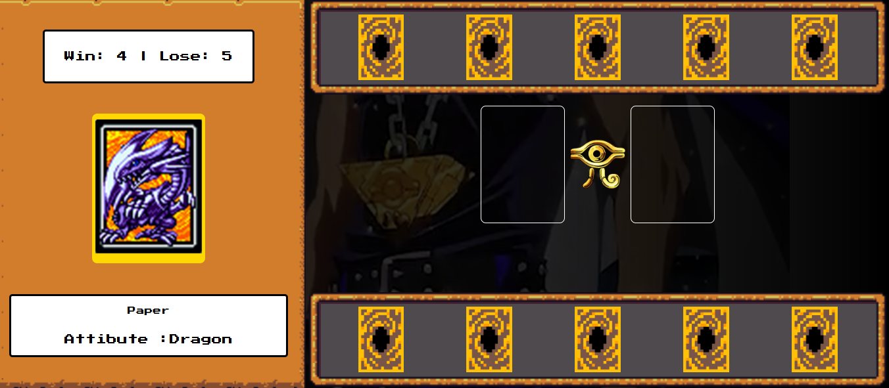

# 🃏 Yu-Gi-Oh! Jo-Ken-Po Edition

Um jogo inspirado no universo de **Yu-Gi-Oh!**, desenvolvido durante um desafio da **Digital Innovation One (DIO)**.

O projeto utiliza **HTML, CSS e JavaScript** para criar uma experiência interativa baseada na lógica do clássico **Jo-Ken-Po (Pedra, Papel e Tesoura)**, utilizando cartas inspiradas em personagens e elementos do universo Yu-Gi-Oh!.

## 🎮 Sobre o projeto

O jogador recebe cartas aleatórias e pode escolher uma delas para enfrentar uma carta selecionada aleatoriamente pelo computador.

Cada carta possui regras de vitória e derrota. Após a escolha:

* A carta do jogador é exibida no campo de batalha.
* O computador seleciona uma carta aleatoriamente.
* O resultado do duelo é calculado automaticamente.
* O placar é atualizado.
* Um botão permite iniciar um novo duelo.

O projeto também possui efeitos visuais, vídeo de fundo, cursores personalizados e animações nas cartas.

---

## ✨ Funcionalidades

* 🃏 Geração dinâmica das cartas utilizando JavaScript.
* 🎲 Sorteio aleatório das cartas.
* 🖱️ Seleção de cartas através de clique.
* 👀 Exibição das informações da carta selecionada.
* ⚔️ Sistema de duelo entre jogador e computador.
* 🏆 Sistema de vitória e derrota.
* 📊 Placar atualizado dinamicamente.
* 🔄 Reinício do duelo.
* 🎴 Cartas do computador exibidas com o verso.
* 🎬 Vídeo de fundo inspirado no universo Yu-Gi-Oh!.
* 🖱️ Cursores personalizados.
* ✨ Efeito de escala ao passar o mouse sobre as cartas.
* 📱 Layout responsivo para diferentes tamanhos de tela.

---

## 🛠️ Tecnologias utilizadas

### Front-end

* HTML5
* CSS3
* JavaScript
* Flexbox
* CSS Media Queries
* DOM Manipulation
* Eventos JavaScript

### Recursos

* Google Fonts
* Assets fornecidos pelo projeto da DIO
* Vídeo de fundo
* Imagens e cursores personalizados

---

## 📂 Estrutura do projeto

```text
js-yugioh/
│
├── index.html
│
└── src/
    ├── assets/
    │   ├── cursor/
    │   ├── icons/
    │   └── video/
    │
    ├── scripts/
    │   └── engine.js
    │
    └── styles/
        ├── buttons.css
        ├── containers_and_frames.css
        ├── main.css
        └── reset.css
        └── responsive.css
```

---

## 🧠 Lógica do jogo

As cartas são armazenadas em um array de objetos no JavaScript.

Cada carta possui um identificador e regras indicando contra quais cartas ela vence ou perde.

Exemplo:

```javascript
const cardData = [
    {
        id: 0,
        name: "Paper",
        type: "Dragon",
        img: `${pathImages}dragon.png`,
        WinOf: [1],
        LoseOf: [2],
    }
];
```

Quando o jogador seleciona uma carta, o sistema:

```text
Jogador escolhe uma carta
          ↓
Computador escolhe uma carta aleatória
          ↓
Sistema verifica as regras
          ↓
Resultado do duelo
          ↓
Atualização do placar
          ↓
Novo duelo
```

---

## 🎯 Objetivo do projeto

O principal objetivo foi praticar conceitos fundamentais de desenvolvimento web utilizando JavaScript, especialmente:

* Manipulação do DOM.
* Criação dinâmica de elementos HTML.
* Eventos de mouse e clique.
* Funções assíncronas.
* Arrays e objetos.
* Estruturas condicionais.
* Manipulação de atributos.
* Atualização dinâmica do conteúdo da página.
* Organização de código.
* Responsividade com CSS.

---

## 📱 Responsividade

O projeto foi adaptado para diferentes tamanhos de tela utilizando **CSS Media Queries**.

Foram consideradas três principais situações:

* 🖥️ Desktop
* 💻 Tablets
* 📱 Smartphones

Em telas menores, o layout passa de uma estrutura horizontal para uma estrutura vertical, reduzindo o tamanho das cartas e reorganizando a área de duelo.

---

## 🚀 Como executar o projeto

### 1. Clone o repositório

```bash
git clone (https://github.com/Lorenconde/js-yugioh-assets)
```

### 2. Acesse a pasta

```bash
cd js-yugioh
```

### 3. Abra o projeto no VS Code

Recomenda-se utilizar a extensão **Live Server**.

No VS Code:

```text
index.html
   ↓
Botão direito
   ↓
Open with Live Server
```

O projeto será aberto no navegador através de um endereço semelhante a:

```text
http://127.0.0.1:5500/
```

> Recomenda-se utilizar o Live Server em vez de abrir o `index.html` diretamente através de `file://`.

---

## 🎮 Como jogar

1. Abra o projeto no navegador.
2. Aguarde as cartas serem carregadas.
3. Escolha uma das cartas do jogador.
4. O computador escolherá uma carta automaticamente.
5. O resultado do duelo será apresentado.
6. O placar será atualizado.
7. Clique no botão de resultado para iniciar um novo duelo.

---

## 📸 Preview

> Página Inicial.

```

```

---

## 📚 Projeto desenvolvido durante a DIO

Este projeto foi desenvolvido como parte dos desafios e conteúdos da **Digital Innovation One (DIO)**, com o objetivo de colocar em prática conhecimentos de **HTML, CSS e JavaScript**.

A implementação também serviu como exercício para compreender melhor a interação entre JavaScript e elementos HTML criados dinamicamente.

---

## 👩‍💻 Desenvolvedora

**Loren Eisfeld Conde Rosa**

Desenvolvedora Front-end em formação, com interesse em desenvolvimento web e criação de interfaces modernas, responsivas e interativas.

### 🔗 Links

* 💼 [LinkedIn](https://www.linkedin.com/in/loren-eisfeld)
* 🐙 [GitHub](https://github.com/Lorenconde)

---

## 📌 Aprendizados

Durante o desenvolvimento deste projeto, foram praticados conceitos importantes de JavaScript, principalmente a criação de elementos dinamicamente, manipulação do DOM e implementação de regras de negócio no front-end.

O projeto também contribuiu para melhorar a compreensão sobre **eventos, funções, arrays, objetos, responsividade e organização de código**.

---

⭐ Se você gostou do projeto, considere deixar uma estrela no repositório!

